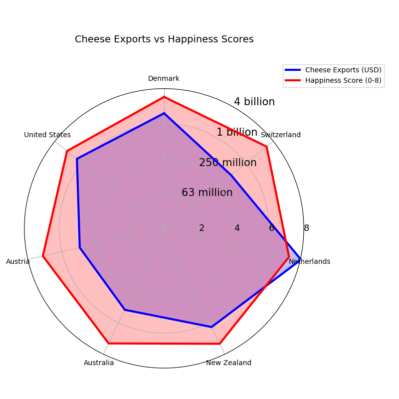

# axis-of-awesome

### !!! Seven of the top 15 cheese importing nations are also among the top 15 happiest, linking cheese to happiness. !!!

## Key Features
* **Reads data from 2 csv files:** `Cheese_Report_2016.csv` and `World_Happiness_Report_2016.csv`
* **Gather overlapping data:** Finds which countries overlap between the top 15 happiest and cheesiest countries.
* **Data Scaling:** Converts all export values (m/bn) cleanly into millions (e.g., 1.4bn --> 1400) and then into a log4 scale.  
* **Dual Axis:** Compares the happiness scores with the cheese exports on 2 visually comparable scales.

## Prerequesites
* **Python 3.8+**
* Python Packages:
      
    `numpy, pandas, matplotlib`
* Install using: 

    `pip install numpy pandas matplotlib`

## Example Graph
Run by using `python radar.py` in the command line:

## Notes

* New csv data can be used and it will be visualized just the same, but labels will have to be manually changed.
* A logarithmic scale is used so the two data sets can appear more visually similar

* **Only set up and tested for WINDOWS USE**:
    * Graph might not appear on Linux systems.
    * If on a linux system, use `python3 radar.py`